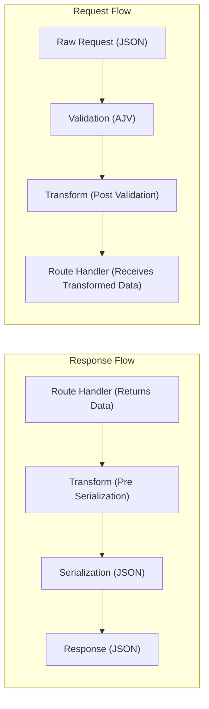

# @shadow-library/fastify

A powerful TypeScript-first Fastify wrapper featuring decorator-based routing, automatic validation, response serialization, and comprehensive middleware support.

## Features

- 🚀 **High Performance**: Built on top of Fastify, one of the fastest Node.js web frameworks
- 🎯 **Decorator-Based**: Clean, intuitive API using TypeScript decorators
- ✅ **Automatic Validation**: Fast validation for body, query, and URL parameters using AJV
- 📝 **Response Serialization**: Consistent response formatting with fast-json-stringify
- 🔒 **Authentication & Authorization**: Built-in support for guards and middleware
- 🛡️ **Error Handling**: Comprehensive error handling with custom error types
- 🔄 **Middleware Support**: Flexible middleware system with lifecycle hooks
- 📊 **Type Safety**: Full TypeScript support with schema generation
- 🎨 **Templating Ready**: Built-in support for templating engines
- ⚡ **Dynamic Module**: Configurable module with `forRoot()` and `forRootAsync()` methods
- 🔢 **API Versioning**: Built-in support for prefix-based API versioning

## Installation

```bash
# npm
npm install @shadow-library/fastify

# yarn
yarn add @shadow-library/fastify

# pnpm
pnpm add @shadow-library/fastify

# bun
bun add @shadow-library/fastify
```

## Quick Start

### 1. Create a Controller

```typescript
import { HttpController, Get, Post, Body, RespondFor } from '@shadow-library/fastify';
import { Schema, Field } from '@shadow-library/class-schema';

@Schema()
class CreateUserDto {
  @Field(() => String, { minLength: 2, maxLength: 50 })
  name: string;

  @Field(() => String, { format: 'email' })
  email: string;
}

@Schema()
class UserResponse {
  @Field(() => Number)
  id: number;

  @Field(() => String)
  name: string;

  @Field(() => String)
  email: string;
}

@HttpController('/api/users')
export class UserController {
  @Get()
  @RespondFor(200, [UserResponse])
  async getUsers(): Promise<UserResponse[]> {
    return [{ id: 1, name: 'John Doe', email: 'john@example.com' }];
  }

  @Post()
  @RespondFor(201, UserResponse)
  async createUser(@Body() userData: CreateUserDto): Promise<UserResponse> {
    // Your business logic here
    return { id: 2, ...userData };
  }
}
```

### 2. Create a Module

`FastifyModule` is a dynamic module that provides both synchronous and asynchronous configuration methods.

```typescript
import { Module } from '@shadow-library/app';
import { FastifyModule } from '@shadow-library/fastify';
import { UserController } from './user.controller';

@Module({
  imports: [
    FastifyModule.forRoot({
      controllers: [UserController],
      port: 3000,
      host: '0.0.0.0',
    }),
  ],
})
export class AppModule {}
```

### 3. Bootstrap Your Application

```typescript
import { ShadowFactory } from '@shadow-library/app';
import { Logger } from '@shadow-library/common';
import { AppModule } from './app.module';

Logger.addDefaultTransports();

async function bootstrap() {
  const app = await ShadowFactory.create(AppModule);
  await app.start();
}

bootstrap();
```

## API Reference

### Decorators

#### Route Decorators

```typescript
@Get(path?: string)        // GET requests
@Post(path?: string)       // POST requests
@Put(path?: string)        // PUT requests
@Patch(path?: string)      // PATCH requests
@Delete(path?: string)     // DELETE requests
@Options(path?: string)    // OPTIONS requests
@Head(path?: string)       // HEAD requests
@Version(version: number)  // Set API version for the route
```

#### Parameter Decorators

```typescript
@Body(schema?: JSONSchema)     // Request body
@Params(schema?: JSONSchema)   // URL parameters
@Query(schema?: JSONSchema)    // Query parameters
@Request() / @Req()            // Raw Fastify request
@Response() / @Res()           // Raw Fastify response
```

#### Response Decorators

```typescript
@RespondFor(statusCode: number, schema: Class | JSONSchema)
@HttpStatus(statusCode: number)
```

#### Controller Decorator

```typescript
@HttpController(prefix?: string)
```

### Example: Advanced Usage with Authentication

```typescript
import { HttpController, Get, Post, Middleware, Body, Params } from '@shadow-library/fastify';

// Custom Authentication Guard
@Middleware({ type: 'preHandler', weight: 100 })
class AuthGuard {
  use(request: HttpRequest, reply: HttpResponse, done: HttpCallback) {
    const token = request.headers.authorization?.replace('Bearer ', '');
    if (!token) {
      return reply.status(401).send({ error: 'Unauthorized' });
    }
    // Validate token logic here
    done();
  }
}

@HttpController('/api/protected')
export class ProtectedController {
  @Get('/profile')
  @RespondFor(200, UserResponse)
  async getProfile(@Request() req): Promise<UserResponse> {
    // Access authenticated user from request
    return req.user;
  }
}
```

### API Versioning

The framework provides a powerful versioning system that allows you to version your APIs using URL path prefixes. This is useful for maintaining multiple versions of your API simultaneously.

#### Enabling Versioning

To enable versioning, set `prefixVersioning: true` in your module configuration:

```typescript
@Module({
  imports: [
    FastifyModule.forRoot({
      controllers: [UserController],
      port: 3000,

      // Enable prefix-based versioning
      prefixVersioning: true,
    }),
  ],
})
export class AppModule {}
```

#### Using the @Version Decorator

Use the `@Version` decorator on your controllers to specify the API version:

```typescript
import { HttpController, Get, Post, Version, Body } from '@shadow-library/fastify';

@HttpController('/api/users')
@Version(1)
export class UserV1Controller {
  @Get()
  async getUsers() {
    return [{ id: 1, name: 'John Doe' }];
  }
}

@HttpController('/api/users')
@Version(2)
export class UserV2Controller {
  @Get()
  async getUsers() {
    // v2 with additional fields
    return [{ id: 1, name: 'John Doe', email: 'john@example.com', createdAt: new Date() }];
  }

  @Post()
  async createUser(@Body() userData: CreateUserDto) {
    // New features in v2
    return { id: 2, ...userData };
  }
}
```

**Result**:

- v1 endpoints: `GET /v1/api/users`
- v2 endpoints: `GET /v2/api/users`, `POST /v2/api/users`

#### Default Version

If versioning is enabled but no `@Version` decorator is specified, routes default to `v1`:

```typescript
@HttpController('/api/products')
export class ProductController {
  @Get()
  async getProducts() {
    return [];
  }
}
// Results in: GET /v1/api/products
```

#### Method-Level Versioning

You can also apply versioning at the method level for more granular control:

```typescript
@HttpController('/api/data')
export class DataController {
  @Get('/stats')
  @Version(1)
  async getStatsV1() {
    return { totalUsers: 100 };
  }

  @Get('/stats')
  @Version(2)
  async getStatsV2() {
    return { totalUsers: 100, activeUsers: 75, newUsers: 10 };
  }

  @Get('/info')
  async getInfo() {
    // This defaults to v1 when versioning is enabled
    return { version: 'v1' };
  }
}
```

**Result**:

- `GET /v1/api/data/stats` → `getStatsV1()`
- `GET /v2/api/data/stats` → `getStatsV2()`
- `GET /v1/api/data/info` → `getInfo()`

#### Versioning Best Practices

1. **Maintain Backward Compatibility**: Keep older versions running while you migrate clients to newer versions
2. **Version Breaking Changes**: Only increment versions for breaking changes in your API
3. **Document Version Differences**: Clearly document what changes between versions
4. **Deprecation Strategy**: Communicate deprecation timelines for older API versions
5. **Consistent Versioning**: Use consistent version numbers across related endpoints

#### Example: Complete Versioned API

```typescript
import { Module } from '@shadow-library/app';
import { FastifyModule, HttpController, Get, Post, Version } from '@shadow-library/fastify';

// Version 1 Controllers
@HttpController('/api/users')
@Version(1)
class UserV1Controller {
  @Get()
  async list() {
    return [{ id: 1, name: 'John' }];
  }
}

@HttpController('/api/posts')
@Version(1)
class PostV1Controller {
  @Get()
  async list() {
    return [{ id: 1, title: 'Hello' }];
  }
}

// Version 2 Controllers - with enhanced features
@HttpController('/api/users')
@Version(2)
class UserV2Controller {
  @Get()
  async list() {
    return [{ id: 1, name: 'John', email: 'john@example.com', role: 'admin' }];
  }

  @Post('/bulk')
  async bulkCreate(@Body() users: CreateUserDto[]) {
    // New feature in v2
    return { created: users.length };
  }
}

@HttpController('/api/posts')
@Version(2)
class PostV2Controller {
  @Get()
  async list() {
    return [{ id: 1, title: 'Hello', content: 'World', tags: ['news'] }];
  }
}

@Module({
  imports: [
    FastifyModule.forRoot({
      controllers: [UserV1Controller, UserV2Controller, PostV1Controller, PostV2Controller],
      prefixVersioning: true,
      port: 3000,
    }),
  ],
})
export class AppModule {}

// Available endpoints:
// GET  /v1/api/users
// GET  /v1/api/posts
// GET  /v2/api/users
// POST /v2/api/users/bulk  (new in v2)
// GET  /v2/api/posts
```

#### Disabling Versioning

If you don't need versioning, simply omit the `prefixVersioning` option or set it to `false`:

```typescript
FastifyModule.forRoot({
  controllers: [UserController],
  prefixVersioning: false, // or omit entirely
  port: 3000,
});
// Routes will be: GET /api/users (no version prefix)
```

### Global Route Prefix

The `routePrefix` configuration option allows you to add a global prefix to all routes in your application. This is useful for:

- **API Namespacing**: Prefix all routes with `/api` to clearly distinguish API endpoints from other routes
- **Multi-tenant Applications**: Add tenant-specific prefixes
- **Microservices**: Namespace your service routes (e.g., `/user-service`, `/payment-service`)
- **API Gateways**: Organize routes by domain or service boundaries

#### Basic Usage

```typescript
@Module({
  imports: [
    FastifyModule.forRoot({
      controllers: [UserController, ProductController],
      routePrefix: 'api',
      port: 3000,
    }),
  ],
})
export class AppModule {}
```

**Example Controllers:**

```typescript
@HttpController('/users')
export class UserController {
  @Get()
  async getUsers() {
    return [];
  }

  @Get('/:id')
  async getUser(@Params() params: { id: string }) {
    return { id: params.id };
  }
}

@HttpController('/products')
export class ProductController {
  @Get()
  async getProducts() {
    return [];
  }
}
```

**Result**:

- `GET /api/users`
- `GET /api/users/:id`
- `GET /api/products`

#### Combining with Versioning

You can use `routePrefix` together with `prefixVersioning` for a well-organized API structure:

```typescript
@Module({
  imports: [
    FastifyModule.forRoot({
      controllers: [UserV1Controller, UserV2Controller],
      routePrefix: 'api',
      prefixVersioning: true,
      port: 3000,
    }),
  ],
})
export class AppModule {}
```

**Result**:

- `GET /api/v1/users`
- `GET /api/v2/users`

The order is always: `/{routePrefix}/{version}/{controller-path}/{route-path}`

#### Multi-Service Example

```typescript
// User Service Module
@Module({
  imports: [
    FastifyModule.forRoot({
      controllers: [UserController, AuthController],
      routePrefix: 'user-service',
      port: 3001,
    }),
  ],
})
export class UserServiceModule {}

// Payment Service Module
@Module({
  imports: [
    FastifyModule.forRoot({
      controllers: [PaymentController, InvoiceController],
      routePrefix: 'payment-service',
      port: 3002,
    }),
  ],
})
export class PaymentServiceModule {}
```

**Result**:

- User Service: `POST /user-service/auth/login`, `GET /user-service/users`
- Payment Service: `POST /payment-service/payments`, `GET /payment-service/invoices`

#### Dynamic Route Prefix

You can also set the prefix dynamically using `forRootAsync`:

```typescript
@Module({
  imports: [
    FastifyModule.forRootAsync({
      useFactory: (configService: ConfigService) => ({
        controllers: [UserController],
        routePrefix: configService.get('API_PREFIX'), // e.g., 'api/v1'
        port: configService.get('PORT'),
      }),
      inject: [ConfigService],
    }),
  ],
})
export class AppModule {}
```

#### Best Practices

1. **Use Consistent Prefixes**: Keep your route prefix consistent across your application
2. **Avoid Deep Nesting**: Keep prefixes shallow for better readability (prefer `/api` over `/api/v1/public`)
3. **Combine with Versioning**: Use `routePrefix` for namespace and `prefixVersioning` for versions
4. **Document Your Routes**: Clearly document the prefix structure for API consumers
5. **Environment-based Prefixes**: Consider different prefixes for different environments if needed

#### Without Route Prefix

If you don't need a global prefix, simply omit the `routePrefix` option:

```typescript
FastifyModule.forRoot({
  controllers: [UserController],
  // No routePrefix specified
  port: 3000,
});
// Routes will be: GET /users (no prefix)
```

### Error Handling

```typescript
import { ServerError, ServerErrorCode } from '@shadow-library/fastify';

@HttpController('/api')
export class ExampleController {
  @Get('/error')
  throwError() {
    // Throws a predefined server error
    throw new ServerError(ServerErrorCode.S008);
  }

  @Get('/custom-error')
  throwCustomError() {
    // Throws a custom error
    throw new Error('Something went wrong');
  }
}
```

### Child Routes and Route Resolution

```typescript
@HttpController('/api')
export class RoutesController {
  constructor(@Inject(Router) private readonly fastifyRouter: FastifyRouter) {}

  @Get('/unified')
  async unifiedRoute(@Query() query: Record<string, any>) {
    const results = [];
    for (const route of query.routes?.split(',') ?? []) {
      const result = await this.fastifyRouter.resolveChildRoute(route);
      results.push(result);
    }
    return { results };
  }
}
```

#### Child Routes Configuration

Child routes enable server-side route resolution, commonly used for SSR (Server-Side Rendering) and internal API composition. When enabled, you can make internal HTTP requests to your own routes without going through the network layer.

**Basic Setup:**

```typescript
@Module({
  imports: [
    FastifyModule.forRoot({
      controllers: [UserController, DataController],

      // Enable child routes functionality
      enableChildRoutes: true,

      // Optional: Provide custom headers for child route requests
      childRouteHeaders: () => ({
        'x-correlation-id': '123',
      }),
    }),
  ],
})
export class AppModule {}
```

**Usage in Controllers:**

```typescript
@HttpController('/api')
export class DataAggregatorController {
  constructor(@Inject(Router) private readonly fastifyRouter: FastifyRouter) {}

  @Get('/dashboard')
  async getDashboardData() {
    // Make internal requests to other routes
    const [users, posts, analytics] = await Promise.all([
      this.fastifyRouter.resolveChildRoute('/api/users'),
      this.fastifyRouter.resolveChildRoute('/api/posts?limit=10'),
      this.fastifyRouter.resolveChildRoute('/api/analytics/summary'),
    ]);

    return {
      dashboard: {
        users,
        posts,
        analytics,
        timestamp: new Date().toISOString(),
      },
    };
  }
}
```

**Custom Headers Function:**

The `childRouteHeaders` function is called for each child route request, allowing you to:

- Pass authentication context from the parent request
- Include tenant/user-specific information
- Add tracing or correlation IDs
- Set internal service flags

```typescript
// Dynamic headers based on current request context
childRouteHeaders: (contextService) => {
  const request = contextService.getRequest();
  return {
    'x-user-id': contextService.get('currentUserId'),
    'x-request-id': contextService.getRID(),
    'x-forwarded-from': 'internal-aggregator',
    'x-correlation-id': request.headers['x-correlation-id'],
  };
},
```

**Important Notes:**

- Child routes always include the header `x-service: 'internal-child-route'`
- Custom headers are merged with the default service header
- If you provide an `x-service` header, it will be overridden with the default value
- Child routes create isolated contexts, preventing middleware conflicts
- Enable only when needed, as it adds routing overhead

## Configuration

### Dynamic Module Configuration

`FastifyModule` is a **dynamic module** that configures itself based on the options you provide. Unlike static modules, dynamic modules return a module configuration object at runtime, allowing for flexible dependency injection and configuration.

The module provides two configuration methods:

#### Synchronous Configuration (forRoot)

```typescript
@Module({
  imports: [
    FastifyModule.forRoot({
      // Basic server configuration
      host: 'localhost',
      port: 8080,

      // Controllers to register
      controllers: [UserController, AuthController],

      // Additional providers
      providers: [UserService, AuthService],

      // Error handling
      errorHandler: new CustomErrorHandler(),

      // Security
      maskSensitiveData: true,

      // Global route prefix
      routePrefix: 'api',

      // API Versioning
      prefixVersioning: true,

      // Request ID generation
      requestIdLogLabel: 'rid',
      genReqId: () => uuid(),

      // Router options
      routerOptions: {
        ignoreTrailingSlash: true,
        ignoreDuplicateSlashes: true,
      },

      // Response schemas for error handling
      responseSchema: {
        '4xx': ErrorResponseSchema,
        '5xx': ErrorResponseSchema,
      },

      // Child routes configuration (for SSR and internal route resolution)
      enableChildRoutes: true,
      childRouteHeaders: contextService => ({
        'x-correlation-id': contextService.getRequest().headers['x-correlation-id'],
      }),

      // Extend Fastify instance before registering controllers
      fastifyFactory: async fastify => {
        // Register plugins, add hooks, or configure Fastify
        await fastify.register(require('@fastify/cors'), {
          origin: true,
        });

        fastify.addHook('onRequest', async (request, reply) => {
          console.log(`Incoming request: ${request.method} ${request.url}`);
        });

        return fastify;
      },
    }),
  ],
})
export class AppModule {}
```

#### Asynchronous Configuration (forRootAsync)

Use `forRootAsync` when you need to inject dependencies or load configuration dynamically:

```typescript
@Module({
  imports: [
    FastifyModule.forRootAsync({
      useFactory: async (configService: ConfigService) => ({
        host: configService.get('HOST'),
        port: configService.get('PORT'),
        controllers: [UserController],
      }),
      inject: [ConfigService],
    }),
  ],
})
export class AppModule {}
```

#### Dynamic Module Benefits

- **Flexible Configuration**: Configure the module differently for different environments
- **Dependency Injection**: Inject services into the module configuration
- **Runtime Configuration**: Load configuration from external sources (databases, config files, etc.)
- **Type Safety**: Full TypeScript support for all configuration options
- **Modular Design**: Easy to compose with other modules in your application

### Extending Fastify Instance

Use the `fastifyFactory` option to customize the Fastify instance before controllers are registered. This is perfect for adding plugins, global hooks, or custom configurations:

```typescript
import { Module } from '@shadow-library/app';
import cors from '@fastify/cors';
import helmet from '@fastify/helmet';
import rateLimit from '@fastify/rate-limit';

@Module({
  imports: [
    FastifyModule.forRoot({
      controllers: [UserController],
      fastifyFactory: async fastify => {
        // Register security plugins
        await fastify.register(helmet, {
          contentSecurityPolicy: {
            directives: {
              defaultSrc: ["'self'"],
              styleSrc: ["'self'", "'unsafe-inline'"],
            },
          },
        });

        // Add CORS support
        await fastify.register(cors, {
          origin: (origin, callback) => {
            const allowedOrigins = ['http://localhost:3000', 'https://myapp.com'];
            if (!origin || allowedOrigins.includes(origin)) {
              callback(null, true);
            } else {
              callback(new Error('Not allowed by CORS'), false);
            }
          },
          credentials: true,
        });

        // Add rate limiting
        await fastify.register(rateLimit, {
          max: 100,
          timeWindow: '1 minute',
        });

        // Add global hooks
        fastify.addHook('onRequest', async (request, reply) => {
          console.log(`[${new Date().toISOString()}] ${request.method} ${request.url}`);
        });

        fastify.addHook('onResponse', async (request, reply) => {
          const responseTime = reply.elapsedTime;
          console.log(`Response sent in ${responseTime}ms`);
        });

        // Add custom context or decorators
        fastify.decorate('config', {
          apiVersion: 'v1',
          environment: process.env.NODE_ENV,
        });

        // Register custom content type parsers
        fastify.addContentTypeParser('text/plain', { parseAs: 'string' }, (req, body, done) => {
          done(null, body);
        });

        return fastify;
      },
    }),
  ],
})
export class AppModule {}
```

#### Common Use Cases for fastifyFactory:

- **Security**: Add helmet, CORS, rate limiting
- **Logging**: Custom request/response logging hooks
- **Authentication**: Register authentication plugins
- **File Upload**: Configure multipart/file upload handling
- **Custom Parsers**: Add support for custom content types
- **Swagger/OpenAPI**: Register documentation plugins
- **Database**: Add database connection decorators
- **Caching**: Configure caching plugins

### Customizing AJV Validation

The module uses [AJV](https://ajv.js.org/) for JSON Schema validation. You can customize the AJV instance by providing custom options or plugins through the `ajv` configuration:

```typescript
import { Module } from '@shadow-library/app';
import { FastifyModule } from '@shadow-library/fastify';
import ajvFormats from 'ajv-formats';
import ajvKeywords from 'ajv-keywords';

@Module({
  imports: [
    FastifyModule.forRoot({
      controllers: [UserController],
      ajv: {
        // Custom AJV options
        customOptions: {
          removeAdditional: 'all',
          coerceTypes: 'array',
          useDefaults: true,
        },
        // AJV plugins - supports both formats:
        // 1. Just the plugin function (uses empty options)
        // 2. Tuple of [plugin, options]
        plugins: [
          ajvFormats, // Plugin without options
          [ajvKeywords, { keywords: ['typeof', 'instanceof'] }], // Plugin with options
        ],
      },
    }),
  ],
})
export class AppModule {}
```

#### AJV Configuration Options

| Option          | Type                                       | Description                                           |
| --------------- | ------------------------------------------ | ----------------------------------------------------- |
| `customOptions` | `object`                                   | Custom AJV options to merge with the default settings |
| `plugins`       | `Array<Plugin \| [Plugin, PluginOptions]>` | Array of AJV plugins to register with both validators |

#### Common Use Cases for AJV Customization:

- **Format Validation**: Add `ajv-formats` for email, uri, date-time validation
- **Custom Keywords**: Use `ajv-keywords` for additional validation keywords
- **Strict Mode**: Configure strict schema validation settings
- **Type Coercion**: Customize how types are coerced during validation

## Middleware

Create custom middleware by implementing the `Middleware` decorator:

```typescript
@Middleware({ type: 'preHandler', weight: 50 })
export class LoggingMiddleware {
  use(request: HttpRequest, reply: HttpResponse, done: HttpCallback) {
    console.log(`${request.method} ${request.url}`);
    done();
  }
}

// Or generate middleware dynamically
@Middleware({ type: 'preValidation', weight: 75 })
export class ValidationMiddleware {
  generate(route: RouteMetadata) {
    return (request: HttpRequest, reply: HttpResponse, done: HttpCallback) => {
      // Custom validation logic based on route metadata
      done();
    };
  }
}
```

## Validation

The package uses `@shadow-library/class-schema` for automatic validation:

```typescript
@Schema()
class CreateProductDto {
  @Field(() => String, {
    minLength: 1,
    maxLength: 100,
    description: 'Product name',
  })
  name: string;

  @Field(() => Number, {
    minimum: 0,
    description: 'Product price in cents',
  })
  price: number;

  @Field(() => [String], {
    maxItems: 10,
    description: 'Product tags',
  })
  tags?: string[];
}
```

## API Documentation Metadata

The `@ApiOperation` decorator allows you to add OpenAPI/Swagger metadata to your route handlers. This metadata is integrated into the Fastify route schema and can be consumed by documentation generators like Swagger UI.

```typescript
@ApiOperation({
  summary: string;              // Short description of the operation
  description?: string;         // Detailed description
  tags?: string[];              // Operation tags for grouping
  deprecated?: boolean;         // Mark if endpoint is deprecated
  externalDocs?: {              // Link to external documentation
    url: string;
    description?: string;
  };
  security?: Record<string, []>; // Security requirements
})
```

### Example Usage

```typescript
import { HttpController, Get, Post, Body, ApiOperation } from '@shadow-library/fastify';

@HttpController('/api/users')
export class UserController {
  @Get()
  @ApiOperation({
    summary: 'List all users',
    description: 'Retrieve a paginated list of all users in the system',
    tags: ['users'],
  })
  async getUsers() {
    return [];
  }

  @Post()
  @ApiOperation({
    summary: 'Create a new user',
    tags: ['users'],
    security: { bearerAuth: [] },
  })
  async createUser(@Body() userData: CreateUserDto) {
    return { id: 1, ...userData };
  }

  @Get('/:id')
  @ApiOperation({
    summary: 'Get user by ID',
    deprecated: false,
  })
  async getUserById() {
    return { id: 1, name: 'John' };
  }
}
```

## Data Transformation

The `@Transform` decorator enables automatic data transformation at two key points in the request-response lifecycle:

1. **After Validation (Request)**: Transforms incoming data (body, query, params) after AJV validation but before it reaches your route handler. This allows validation to run against the original data type while your handler receives the transformed type.

2. **Before Serialization (Response)**: Transforms outgoing response data before it's serialized and sent to the client. This allows you to work with one data type internally while presenting a different format to API consumers.

### How It Works

The `@Transform` decorator works in conjunction with `@Field` from `@shadow-library/class-schema`. The `@Field` decorator defines the **source/validation type** (the type used for JSON Schema validation), while `@Transform` converts the data to the **target type** (the type your code actually works with or returns to the client).



### Basic Usage

The `@Transform` decorator accepts either a transformer name (string) or an options object:

```typescript
// Single transformer - applies to both input and output
@Transform('string:trim')

// Options object - specify different transformers for input and output
@Transform({ input: 'int:parse', output: 'int:stringify' })

// Options object - specify only input or output
@Transform({ input: 'string:trim' })  // Only transforms input
@Transform({ output: 'email:normalize' })  // Only transforms output
```

#### Example

```typescript
import { Schema, Field } from '@shadow-library/class-schema';
import { Transform } from '@shadow-library/fastify';

@Schema()
class CreateUserDto {
  @Field(() => String)
  @Transform('string:trim')
  name: string;

  @Field(() => String, { format: 'email' })
  @Transform('email:normalize')
  email: string;
}

@HttpController('/users')
export class UserController {
  @Post()
  async createUser(@Body() userData: CreateUserDto) {
    // userData.name is automatically trimmed
    // userData.email is normalized (trimmed and lowercased)
    return this.userService.create(userData);
  }
}
```

### Built-in Transformers

The following transformers are available out of the box:

| Transformer       | Input Type | Output Type | Description                                                                          |
| ----------------- | ---------- | ----------- | ------------------------------------------------------------------------------------ |
| `email:normalize` | `string`   | `string`    | Trims whitespace and converts to lowercase                                           |
| `string:trim`     | `string`   | `string`    | Removes leading and trailing whitespace                                              |
| `int:parse`       | `string`   | `number`    | Parses string to integer (base 10)                                                   |
| `float:parse`     | `string`   | `number`    | Parses string to floating-point number                                               |
| `bigint:parse`    | `string`   | `bigint`    | Parses string to BigInt                                                              |
| `strip:null`      | `any`      | `any`       | Returns undefined when the field is null which will remove the field from the object |

### Request Transformation Examples

#### Normalizing User Input

```typescript
@Schema()
class SignUpDto {
  @Field(() => String)
  @Transform('string:trim')
  username: string;

  @Field(() => String, { format: 'email' })
  @Transform('email:normalize')
  email: string;

  @Field(() => String)
  password: string;
}
```

#### Parsing Query Parameters

Query parameters are always received as strings from the HTTP layer. Use `@Transform` to convert them to the appropriate type while keeping `@Field` for validation:

```typescript
@Schema()
class PaginationQuery {
  // @Field defines the validation type (string from query params)
  // @Transform converts the validated string to a number for your handler
  @Field(() => String, { pattern: '^[0-9]+$' })
  @Transform('int:parse')
  page: number;

  @Field(() => String, { pattern: '^[0-9]+$' })
  @Transform('int:parse')
  limit: number;
}

@HttpController('/products')
export class ProductController {
  @Get()
  async getProducts(@Query() query: PaginationQuery) {
    // query.page and query.limit are numbers here, not strings
    // Validation ensured they were numeric strings before transformation
    return this.productService.findAll(query.page, query.limit);
  }
}
```

#### Working with Large Numbers

JavaScript numbers lose precision beyond `Number.MAX_SAFE_INTEGER`. Use BigInt for large numbers while transmitting as strings:

```typescript
@Schema()
class TransactionDto {
  // Validated as a string (safe for JSON transmission)
  // Transformed to BigInt for precise arithmetic in your handler
  @Field(() => String, { pattern: '^-?[0-9]+$' })
  @Transform('bigint:parse')
  amount: bigint;

  @Field(() => String)
  recipientId: string;
}

@HttpController('/transactions')
export class TransactionController {
  @Post()
  async createTransaction(@Body() dto: TransactionDto) {
    // dto.amount is a BigInt - safe for precise calculations
    const fee = dto.amount / 100n; // BigInt arithmetic
    return this.transactionService.process(dto);
  }
}
```

### Response Transformation Examples

Transformers also work on response schemas, allowing you to convert internal data types to API-friendly formats.

#### Currency Formatting

Store and compute with integers (cents) to avoid floating-point errors, but display as decimal strings for the API:

```typescript
// Define a custom transformer for cents to decimal conversion
declare module '@shadow-library/fastify' {
  export interface CustomTransformers {
    'currency:format': (value: number) => string;
  }
}

// Register the transformer in your module config
FastifyModule.forRoot({
  controllers: [ProductController],
  transformers: {
    'currency:format': (cents: number) => (cents / 100).toFixed(2),
  },
});

// Use in your response DTO
@Schema()
class ProductResponse {
  @Field(() => Number)
  id: number;

  @Field(() => String)
  name: string;

  // Internally stored as integer (cents), transformed to "19.99" format for API response
  @Field(() => String)
  @Transform('currency:format')
  price: number; // TypeScript type is what is used internally
}

@HttpController('/products')
export class ProductController {
  @Get('/:id')
  @RespondFor(200, ProductResponse)
  async getProduct(@Params() params: { id: string }): Promise<ProductResponse> {
    const product = await this.productService.findById(params.id);
    // product.price = 1999 (integer cents from database)
    return product;
    // Response: { id: 1, name: "Widget", price: "19.99" }
  }
}
```

#### Date Formatting

```typescript
declare module '@shadow-library/fastify' {
  export interface CustomTransformers {
    'date:iso': (value: Date) => string;
  }
}

FastifyModule.forRoot({
  controllers: [EventController],
  transformers: {
    'date:iso': (date: Date) => date.toISOString(),
  },
});

@Schema()
class EventResponse {
  @Field(() => String)
  name: string;

  // Date object internally, ISO string in API response
  @Field(() => String)
  @Transform('date:iso')
  startDate: Date;
}
```

### Different Input and Output Transformers

Sometimes you need different transformations for incoming requests vs outgoing responses. The `@Transform` decorator supports separate `input` and `output` options:

```typescript
declare module '@shadow-library/fastify' {
  export interface CustomTransformers {
    'cents:parse': (value: string) => number;
    'cents:format': (value: number) => string;
  }
}

FastifyModule.forRoot({
  controllers: [TransactionController],
  transformers: {
    'cents:parse': (value: string) => Math.round(parseFloat(value) * 100),
    'cents:format': (cents: number) => (cents / 100).toFixed(2),
  },
});

@Schema()
class TransactionDto {
  @Field(() => String)
  @Transform({ input: 'cents:parse', output: 'cents:format' })
  amount: number;
}

@HttpController('/transactions')
export class TransactionController {
  @Post()
  @RespondFor(201, TransactionDto)
  async createTransaction(@Body() dto: TransactionDto): Promise<TransactionDto> {
    // Request: { "amount": "19.99" }
    // dto.amount = 1999 (parsed to cents)

    // Your business logic works with cents (integers)
    const saved = await this.transactionService.save(dto);

    return saved;
    // Response: { "amount": "19.99" } (formatted back to decimal string)
  }
}
```

#### Input-Only or Output-Only Transformations

You can also specify only input or output transformation:

```typescript
@Schema()
class SearchQuery {
  // Only transform input - sanitize search terms
  @Field(() => String)
  @Transform({ input: 'string:trim' })
  query: string;
}

@Schema()
class UserResponse {
  @Field(() => String)
  name: string;

  // Only transform output - mask email for privacy
  @Field(() => String)
  @Transform({ output: 'email:mask' })
  email: string;
}
```

### Extending with Custom Transformers

#### Step 1: Declare the Transformer Types

Extend the `CustomTransformers` interface for type-safe transformer names:

```typescript
declare module '@shadow-library/fastify' {
  export interface CustomTransformers {
    'phone:normalize': (value: string) => string;
    'currency:format': (value: number) => string;
    'date:parse': (value: string) => Date;
    'boolean:parse': (value: string) => boolean;
  }
}
```

#### Step 2: Register Transformers in Module Config

```typescript
@Module({
  imports: [
    FastifyModule.forRoot({
      controllers: [UserController, ProductController],
      transformers: {
        'phone:normalize': (phone: string) => phone.replace(/[^0-9+]/g, ''),
        'currency:format': (cents: number) => (cents / 100).toFixed(2),
        'date:parse': (dateStr: string) => new Date(dateStr),
        'boolean:parse': (value: string) => value === 'true' || value === '1',
      },
    }),
  ],
})
export class AppModule {}
```

#### Step 3: Use in Your Schemas

```typescript
@Schema()
class UserDto {
  @Field(() => String)
  @Transform('phone:normalize')
  phone: string;

  @Field(() => String)
  @Transform('boolean:parse')
  isActive: boolean;
}
```

### Best Practices

1. **Validate First, Transform After**: The `@Field` decorator defines what's valid input. `@Transform` converts valid input to your preferred type.

2. **Use Strings for Query/Params Validation**: Query parameters and URL params are always strings. Validate them as strings, then transform:

   ```typescript
   @Field(() => String, { pattern: '^[0-9]+$' }) // Validate as numeric string
   @Transform('int:parse') // Convert to number
   id: number;
   ```

3. **Avoid Floating-Point for Currency**: Store monetary values as integers (cents) and use transformers for display formatting.

4. **Keep Transformers Pure**: Transformers should be pure functions without side effects.

5. **Handle Edge Cases**: Ensure your custom transformers handle edge cases like empty strings, null values, etc.

## Response Serialization

Define response schemas for automatic serialization and documentation:

```typescript
@Schema()
class ProductResponse {
  @Field(() => Number)
  id: number;

  @Field(() => String)
  name: string;

  @Field(() => Number)
  price: number;

  @Field(() => Date)
  createdAt: Date;
}

@HttpController('/products')
export class ProductController {
  @Get('/:id')
  @RespondFor(200, ProductResponse)
  @RespondFor(404, ErrorResponse)
  async getProduct(@Params() params: { id: number }): Promise<ProductResponse> {
    // Only the fields defined in ProductResponse will be serialized
    return this.productService.findById(params.id);
  }
}
```

## Context Service

The `ContextService` provides request-scoped context management using Node.js AsyncLocalStorage. It allows you to access request-specific data from anywhere in your application without explicitly passing it through function parameters.

**Important**: Context is automatically initialized for all HTTP requests and is always available within the request-response lifecycle (controllers, middleware, guards, services called during request processing). The `isInitialized()` method is primarily useful for methods that might be called both within and outside the request-response scope, such as during application startup, migrations, or background tasks.

### Accessing Context Service

```typescript
import { ContextService } from '@shadow-library/fastify';

@HttpController('/api')
export class ExampleController {
  constructor(private readonly contextService: ContextService) {}

  @Get('/current-request')
  getCurrentRequestInfo() {
    const request = this.contextService.getRequest();
    const rid = this.contextService.getRID();

    return {
      method: request.method,
      url: request.url,
      requestId: rid,
      userAgent: request.headers['user-agent'],
    };
  }
}
```

### Core Methods

#### Context State Management

```typescript
// Check if context is initialized
// Useful for methods that may be called outside request-response scope
// (e.g., during migrations, startup tasks, background jobs)
contextService.isInitialized(): boolean

// Check if running in a child context (for nested operations)
contextService.isChildContext(): boolean
```

#### Request/Response Access

```typescript
// Get the current HTTP request object
contextService.getRequest(): FastifyRequest
contextService.getRequest(false): FastifyRequest | null

// Get the current HTTP response object
contextService.getResponse(): FastifyReply
contextService.getResponse(false): FastifyReply | null

// Get the current request ID
contextService.getRID(): string
contextService.getRID(false): string | null
```

#### Data Storage

```typescript
// Store data in current context
contextService.set('user', userData);
contextService.set('startTime', Date.now());

// Retrieve data from current context
const user = contextService.get('user');
const startTime = contextService.get('startTime', true); // throws if missing

// Store data in parent context (when in child context)
contextService.setInParent('sharedData', value);

// Get data from parent context
const parentData = contextService.getFromParent('sharedData');

// Resolve data (checks current context first, then parent)
const resolvedData = contextService.resolve('someKey');
```

### Practical Examples

#### Service Used in Multiple Contexts

```typescript
@Injectable()
export class UserService {
  constructor(private readonly contextService: ContextService) {}

  async getUserInfo(userId: string) {
    // This service method might be called during HTTP requests
    // OR during migrations/background tasks
    if (this.contextService.isInitialized()) {
      // We're in a request context - can access request-specific data
      const requestId = this.contextService.getRID();
      console.log(`Fetching user ${userId} for request ${requestId}`);

      // Maybe add audit trail with request context
      const request = this.contextService.getRequest();
      await this.auditLog.log({
        action: 'getUserInfo',
        userId,
        requestId,
        userAgent: request.headers['user-agent'],
        ip: request.ip,
      });
    } else {
      // We're outside request context (migration, background task, etc.)
      console.log(`Fetching user ${userId} outside request context`);
    }

    return this.database.findUser(userId);
  }
}
```

#### Migration Script Example

```typescript
// During migrations, context is not initialized
class UserMigration {
  constructor(private readonly userService: UserService) {}

  async migrateBulkUsers() {
    // Context is NOT initialized here
    console.log('Context initialized:', this.contextService.isInitialized()); // false

    const users = await this.userService.getAllUsers(); // Works fine
    // Process users...
  }
}
```

#### Request Logging Middleware

```typescript
@Middleware({ type: 'onRequest', weight: 100 })
export class RequestLoggerMiddleware {
  constructor(private readonly contextService: ContextService) {}

  use(request: FastifyRequest, reply: FastifyReply, done: Function) {
    // Context is ALWAYS initialized in middleware during requests
    // No need to check isInitialized() here
    this.contextService.set('startTime', Date.now());
    this.contextService.set('userIP', request.ip);
    done();
  }
}

@Middleware({ type: 'onResponse', weight: 100 })
export class ResponseLoggerMiddleware {
  constructor(private readonly contextService: ContextService) {}

  use(request: FastifyRequest, reply: FastifyReply, done: Function) {
    // Context is ALWAYS initialized in middleware during requests
    const startTime = this.contextService.get<number>('startTime');
    const duration = startTime ? Date.now() - startTime : 0;

    console.log({
      requestId: this.contextService.getRID(),
      method: request.method,
      url: request.url,
      statusCode: reply.statusCode,
      duration: `${duration}ms`,
      userIP: this.contextService.get('userIP')
    });
    done();
  }
}

      console.log({
        requestId: this.contextService.getRID(),
        method: request.method,
        url: request.url,
        statusCode: reply.statusCode,
        duration: `${duration}ms`,
        userIP: this.contextService.get('userIP'),
      });
    }
    done();
  }
}
```

#### Authentication Context

```typescript
@Middleware({ type: 'preHandler', weight: 90 })
export class AuthMiddleware {
  constructor(private readonly contextService: ContextService) {}

  async use(request: FastifyRequest, reply: FastifyReply) {
    const token = request.headers.authorization?.replace('Bearer ', '');

    if (token) {
      // Context is always available in middleware during requests
      const user = await this.validateToken(token);
      if (user) {
        // Store authenticated user in context
        this.contextService.set('currentUser', user);
        this.contextService.set('isAuthenticated', true);
      }
    }
  }
}

// Use in any controller or service
@HttpController('/api/profile')
export class ProfileController {
  constructor(private readonly contextService: ContextService) {}

  @Get()
  getProfile() {
    // Context is always available in controllers during requests
    const isAuthenticated = this.contextService.get<boolean>('isAuthenticated');
    if (!isAuthenticated) {
      throw new ServerError(ServerErrorCode.UNAUTHORIZED);
    }

    const currentUser = this.contextService.get('currentUser');
    return { user: currentUser };
  }
}
```

#### Child Context Usage

```typescript
@HttpController('/api')
export class DataController {
  constructor(
    private readonly contextService: ContextService,
    @Inject(Router) private readonly fastifyRouter: FastifyRouter,
  ) {}

  @Get('/aggregate')
  async getAggregateData() {
    const results = [];

    // Each child route call creates a new child context
    for (const endpoint of ['/users', '/posts', '/comments']) {
      const result = await this.fastifyRouter.resolveChildRoute(endpoint);
      results.push(result);
    }

    return { aggregated: results };
  }
}
```

### Extending Context Service

The `ContextService` can be extended with custom methods to add application-specific functionality while maintaining type safety and method chaining capabilities.

```typescript
import { contextService } from '@shadow-library/fastify';

declare module '@shadow-library/fastify' {
  export interface ContextExtension {
    setUserRole(role: string): ContextService;
    getUserRole(): string;
    setCurrentUserId(userId: string): ContextService;
    getCurrentUserId(): string;
  }
}

// Extend the context service with custom methods
contextService.extend({
  setUserRole(role: string) {
    return this.set('user-role', role);
  },
  getUserRole() {
    return this.get<string>('user-role', false);
  },
  setCurrentUserId(userId: string) {
    return this.set('current-user-id', userId);
  },
  getCurrentUserId() {
    return this.get<string>('current-user-id', false);
  },
});

// Use in controllers with method chaining
@HttpController('/api')
export class UserController {
  constructor(private readonly contextService: ContextService) {}

  @Post('/login')
  async login(@Body() loginDto: LoginDto) {
    const user = await this.authService.validateUser(loginDto);

    // Chain extended methods
    this.contextService.setCurrentUserId(user.id).setUserRole(user.role);

    return { message: 'Login successful' };
  }

  @Get('/profile')
  getProfile() {
    return {
      userId: this.contextService.getCurrentUserId(),
      role: this.contextService.getUserRole(),
      requestId: this.contextService.getRID(),
    };
  }
}
```

## Examples

Check out the [examples](./examples) directory for complete working examples:

- **hello-world**: Basic HTTP controller with GET/POST routes
- **user-auth**: Advanced example with authentication guards
- **child-routes**: Route resolution, unified endpoints, and custom headers for SSR

## Contributing

Contributions are welcome! Please read the [Contributing Guide](./CONTRIBUTING.md) for details.

## License

This package is licensed under the MIT License. See the [LICENSE](./LICENSE) file for more information.
